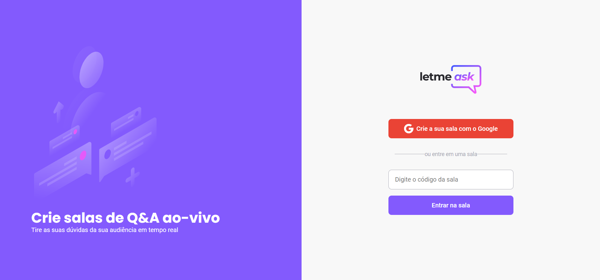
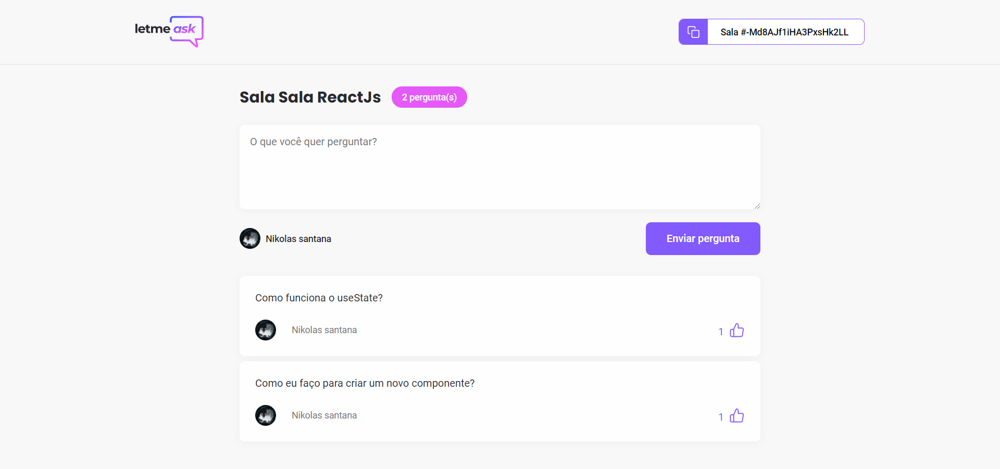
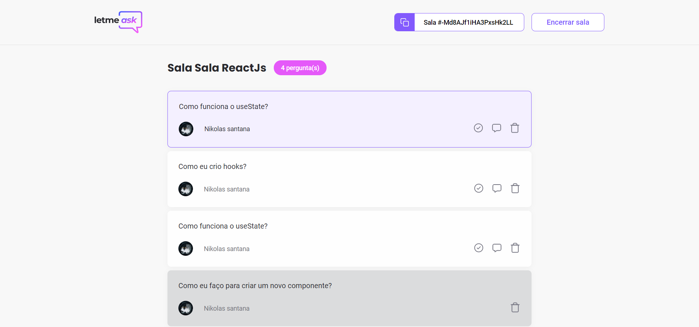

  # Letmeask 

<p align="center">
   
</p>

<p align="center">
  
  
  <a href="https://github.com/Nikolas-as/letmeask/commits/main">
    
  </a>

  
</p>

<p align="center">
  <a href="#sobre">Sobre</a>&nbsp;&nbsp;&nbsp;|&nbsp;&nbsp;&nbsp;
  <a href="#tecnologias-utilizadas">Tecnologias utilizadas</a>&nbsp;&nbsp;&nbsp;|&nbsp;&nbsp;&nbsp;
  <a href="#como-rodar">Como rodar?</a>&nbsp;&nbsp;&nbsp;&nbsp;&nbsp;&nbsp;
</p>

## Sobre
Projeto desenvolvido durante a Next Level Week #6 da [Rocketseat](https://rocketseat.com.br/). O letmeask é um app desenvolvido durante a NLW #6 que permite que alguém realizando uma reunião crie uma sala para receber perguntas, tendo maior interação com os usuários.
<p align="center">
   
  
</p>


## Template no Figma:
- [Layout Web](https://www.figma.com/file/ITmt54Pz9ssMKU3pRMPHLS/Letmeask-(Copy)?node-id=0%3A1)

## Tecnologias utilizadas

Este projeto foi desenvolvido utilizando as seguintes tecnologias:

- [ReactJS](https://reactjs.org/)
- [Typescript](https://www.typescriptlang.org/)
- [Sass](https://sass-lang.com/)
- [Firebase](https://firebase.google.com/?hl=pt)


## Como rodar?

Execute os comandos no seu terminal:

```bash
# Clone o repositório
$ git clone https://github.com/Nikolas-as/Letmeask.git

# Entre nele
$ cd letmeask

# Instale as dependências
$ yarn install

# Execute a aplicação
$ yarn start
```

Acesse em seu navegador http://localhost:3000/ para ver o resultado.


[](https://www.linkedin.com/in/nikolas-santana-0a00091a7/)
